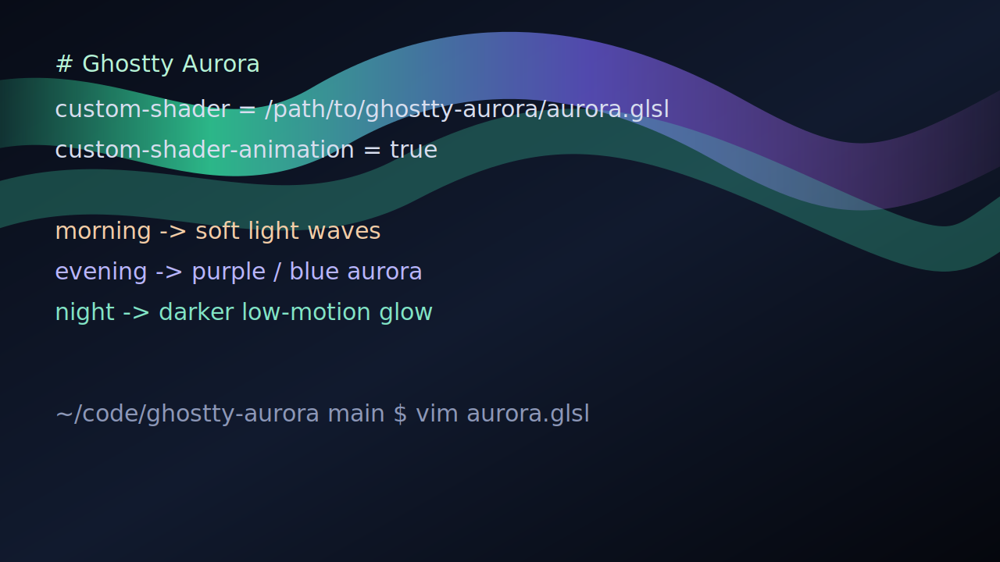

# Ghostty Aurora

A subtle northern-lights shader set for [Ghostty](https://ghostty.org/) terminal backgrounds.

Ghostty Aurora paints soft procedural ribbons behind your terminal text. It ships multiple variants, preset packs, and seasonal modes as standalone GLSL files that only sample Ghostty's built-in `iChannel0` terminal texture.



## Variants

Core:

- `aurora-lite.glsl`: calmer, cheaper, and extra conservative around text.
- `aurora-minimal.glsl`: aurora-only, low haze, and very calm for daily use.
- `aurora.glsl`: balanced default and the recommended daily driver.
- `aurora-rich.glsl`: deeper curtains and faint static stars.
- `polaris.glsl`: cold no-star aurora with a darker polar palette.

Presets:

- `aurora-arctic.glsl`: bright teal and glacial blue ribbons with a crisp cold feel.
- `aurora-nebula.glsl`: purple, magenta, and blue ribbons with a richer sci-fi mood.
- `aurora-fjord.glsl`: green, teal, and deep-water blue with slower calm motion.
- `aurora-midnight.glsl`: deep low-intensity blue-green for late-night sessions.
- `aurora-solar.glsl`: warmer sunrise amber and teal ribbons without getting loud.

Seasonal:

- `aurora-winter.glsl`: icy blue-green ribbons with soft snow-night restraint.
- `aurora-spring.glsl`: fresh green with light coral morning tones.
- `aurora-summer-night.glsl`: warm dusk edges with relaxed blue-green night ribbons.
- `aurora-autumn.glsl`: muted gold, moss, and rose ribbons for a warmer terminal.
- `aurora-deep-winter.glsl`: dark, slow, and extra conservative for long night use.

Theme matched:

- `aurora-theme-oled.glsl`: lowest glow and strongest text protection for near-black OLED themes.
- `aurora-theme-dark.glsl`: balanced contrast for typical dark terminal themes.
- `aurora-theme-warm.glsl`: muted gold, green, and rose for warm dark palettes.
- `aurora-theme-transparent.glsl`: lower haze for transparent windows where the desktop already adds texture.
- `aurora-theme-light.glsl`: very restrained overlay for light or light-ish terminal backgrounds.

## Which Variant Should I Use?

| Use case | Try first |
| --- | --- |
| You want the default look | `aurora` |
| You want the calmest daily driver | `minimal` |
| You want fewer GPU cycles | `lite`, `midnight`, or `theme-oled` |
| You use a typical dark theme | `theme-dark` |
| You use a warm theme | `theme-warm` or `autumn` |
| You use transparency | `theme-transparent` |
| You use a light-ish theme | `theme-light` |
| You want a stronger visual preset | `nebula`, `arctic`, or `solar` |

Polaris is a separate shader file, not an in-terminal runtime toggle. Ghostty selects shaders through config, so switching variants means changing the configured shader path and reloading config.

## Install

Clone the repo:

```sh
git clone https://github.com/ya-nsh/ghostty-aurora.git
```

Use the default balanced shader directly:

```conf
custom-shader = /path/to/ghostty-aurora/aurora.glsl
custom-shader-animation = true
```

Or use the switchable config fragment:

```conf
config-file = /path/to/ghostty-aurora/config/ghostty-aurora.conf
```

Then reload Ghostty config or open a new window.

On macOS, Ghostty's config is usually at:

```text
~/Library/Application Support/com.mitchellh.ghostty/config
```

On Linux, it is usually at:

```text
~/.config/ghostty/config
```

## Switching

This repo includes a tiny switcher that rewrites only `config/ghostty-aurora.conf`.

```sh
bin/ghostty-aurora list
bin/ghostty-aurora current
bin/ghostty-aurora use lite
bin/ghostty-aurora use minimal
bin/ghostty-aurora use aurora
bin/ghostty-aurora use rich
bin/ghostty-aurora use polaris
bin/ghostty-aurora use arctic
bin/ghostty-aurora use winter
bin/ghostty-aurora use theme-dark --intensity 0.45
```

After switching, reload Ghostty config. In the local setup this repo was built for, that is:

```text
cmd+s then r
```

## Local Intensity Overrides

Use these when a variant is close, but a little too bright or too quiet for your theme:

```sh
bin/ghostty-aurora intensity get
bin/ghostty-aurora intensity set 0.45
bin/ghostty-aurora intensity reset
```

`intensity set` writes `config/active.glsl`, patches only `AURORA_INTENSITY`, and points `config/ghostty-aurora.conf` at that local shader. `config/active.glsl` is ignored by git. Running `bin/ghostty-aurora use <variant>` without `--intensity` returns to the committed shader file for that variant.

## Tuning

Generated shader files can be edited directly for quick experiments, but durable changes should go in `src/aurora.template.glsl` and `scripts/build-variants.mjs`.

Regenerate all variants:

```sh
node scripts/build-variants.mjs
```

Useful constants near the top of each generated shader:

```glsl
const float AURORA_INTENSITY = 0.62;
const float RIBBON_SPEED = 0.035;
const float RIBBON_SCALE = 1.00;
const float MORNING_MIX = 0.0;
const float EVENING_MIX = 1.0;
const float NIGHT_MIX = 0.0;
const float TEXT_PROTECT = 0.88;
#define TIME_MODE 0
```

`TIME_MODE`:

- `0`: manual mix using `MORNING_MIX`, `EVENING_MIX`, and `NIGHT_MIX`.
- `1`: preview cycle using `iTime`; useful for demo recordings.
- `2`: future wall-clock mode using `iDate.w`.

Ghostty currently documents `iDate` as not supported, so the committed default is manual mode. The shader keeps the `iDate` path in place so wall-clock dayparts can be enabled when Ghostty populates that uniform.

## Preview

The preview loads the generated shader files and compiles them in WebGL.

```sh
python3 -m http.server 8765
```

Then open:

```text
http://127.0.0.1:8765/preview/
```

Use the variant buttons to switch between the core, preset, and seasonal shaders. Use the daypart buttons to preview morning, evening, night, or the `iTime` cycle.

For a grid view of every generated shader, open:

```text
http://127.0.0.1:8765/preview/gallery.html
```

See [docs/performance.md](docs/performance.md) for relative shader cost notes and variant selection guidance.

## Troubleshooting

- If the terminal goes black, remove or comment out the Aurora config line, reload Ghostty, and check the shader path.
- If the variant did not change, run `bin/ghostty-aurora current`, then reload Ghostty config.
- If effects look stacked or too bright, check that your Ghostty config does not contain multiple Aurora `custom-shader` entries.
- If the aurora does not animate, make sure `custom-shader-animation = true` is set.
- If the aurora is too strong, use `aurora-lite.glsl` or lower `AURORA_INTENSITY`.
- If text readability suffers, raise `TEXT_PROTECT`.
- If you use a light terminal theme, Aurora intentionally stays very subtle to protect contrast.

## License

MIT
